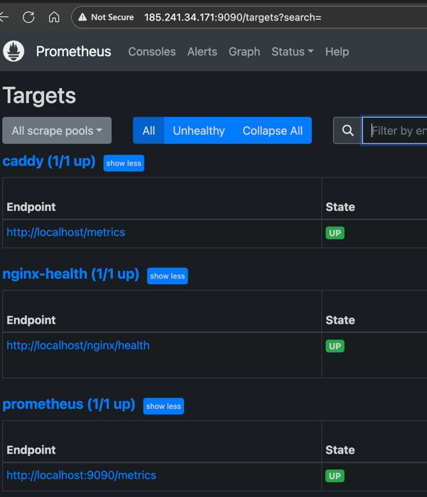
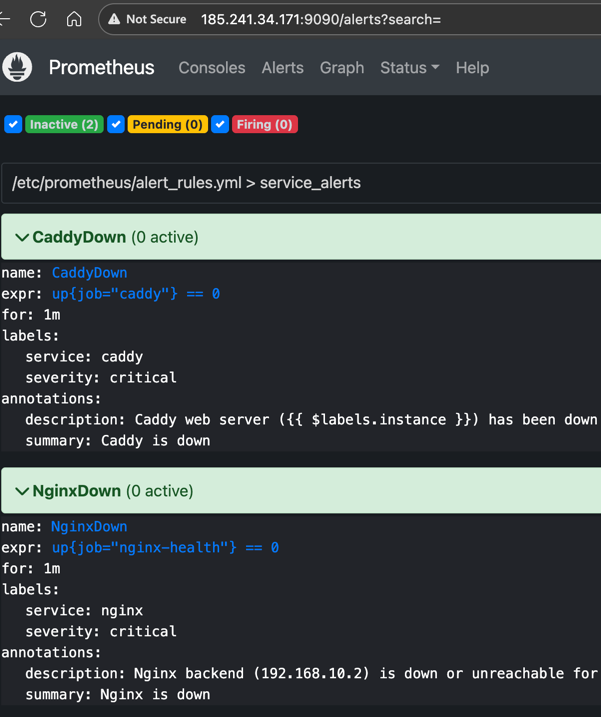

# GS Lab - Infrastructure Project

## Overview

This project demonstrates a secure, cloud-based infrastructure setup using **Infrastructure as Code (IaC)** principles. The infrastructure is provisioned with **Terraform** and configured using **Ansible** playbooks.

## Table of Contents

- [Architecture](#architecture)
  - [Network Topology](#network-topology)
  - [Security Features](#security-features)
    - [Firewall Configuration](#firewall-configuration)
    - [SSH Access](#ssh-access)
    - [Storage](#storage)
- [Infrastructure Deployment](#infrastructure-deployment)
  - [Prerequisites](#prerequisites)
  - [Provisioning with Terraform](#provisioning-with-terraform)
- [Configuration Management](#configuration-management)
  - [Ansible Playbooks](#ansible-playbooks)
  - [Caddy Setup](#caddy-setup-setup_caddyyml)
  - [Nginx Setup](#nginx-setup-setup_nginxyml)
  - [Prometheus Monitoring](#prometheus-monitoring)
- [Monitoring and Validation](#monitoring-and-validation)
  - [Prometheus Dashboard](#prometheus-dashboard)
    - [Active Targets Verification](#active-targets-verification)
    - [Alert Configuration Validation](#alert-configuration-validation)
  - [Reverse Proxy Routing Validation](#reverse-proxy-routing-validation)

## Architecture

The solution comprises two Ubuntu-based virtual machines deployed within a private network (`192.168.10.0/24`):

- **VM1 (Caddy Gateway)** - `192.168.10.1`
  - Hosts Caddy web server (reverse proxy)
  - Hosts Prometheus monitoring system
  - Publicly accessible via external IP
  - Acts as the internet-facing gateway

- **VM2 (Nginx Backend)** - `192.168.10.2`
  - Runs Nginx web server
  - Internal-only access (no direct internet exposure)
  - Accessible only through VM1's reverse proxy

### Network Topology

```
Internet
   │
   ↓
[Firewall VM1] ← Allows: HTTP(80), SSH(22), Prometheus(9090), High Ports
   │
   ↓
[VM1 - Caddy + Prometheus]
   │ (192.168.10.0/24)
   ↓
[VM2 - Nginx] ← [Firewall VM2] ← Blocks all inbound traffic
```

### Security Features

#### Firewall Configuration

**VM1 (Caddy Gateway):**
- **Inbound:** Only ports 80 (HTTP), 22 (SSH), 9090 (Prometheus), and high-level ports are allowed
- **Outbound:** Full internet access
- **Role:** Public-facing gateway

**VM2 (Nginx Backend):**
- **Inbound:** All traffic blocked (except from VM1 via private network)
- **Outbound:** Full internet access for updates and dependencies
- **Role:** Private backend server

#### SSH Access

- Password authentication is **disabled** on all VMs
- SSH access requires **public key authentication** only
- Public keys are provisioned during infrastructure deployment

#### Storage

Each virtual machine has dedicated block storage attached for data persistence and application requirements.

## Infrastructure Deployment

### Prerequisites

- Terraform >= 1.0
- Ansible >= 2.9
- SSH key pair generated
- Cloud provider credentials configured

### Provisioning with Terraform

The infrastructure is defined in Terraform configuration files:

- `provider.tf` - Cloud provider configuration
- `network.tf` - Network and subnet definitions
- `caddy.tf` - Caddy VM resource definitions
- `nginx.tf` - Nginx VM resource definitions
- `variables.tf` - Input variables
- `outputs.tf` - Output values (IPs, hostnames, etc.)
- `data.tf` - Data sources

## Configuration Management

### Ansible Playbooks

Configuration is automated using Ansible playbooks located in the `ansible/` directory:

- `setup_caddy.yml` - Configures Caddy web server and reverse proxy
- `setup_nginx.yml` - Configures Nginx web server
- `setup_prometheus.yml` - Configures Prometheus monitoring
- `test_connection.yml` - Validates SSH connectivity

### Caddy Setup (`setup_caddy.yml`)

The Caddy playbook performs the following tasks:

1. **Installation:**
   - Updates system packages
   - Adds Caddy GPG key and repository
   - Installs Caddy from the official Debian package

2. **Web Configuration:**
   - Creates web root directory at `/var/www/html`
   - Deploys custom `index.html` with server information
   - Sets proper file permissions (owner: `caddy:caddy`)

3. **Caddyfile Configuration (`/etc/caddy/Caddyfile`):**
   - Listens on port 80 for HTTP traffic
   - Enables Prometheus metrics endpoint (`/metrics` on localhost)
   - Configures health check endpoint (`/health`)
   - **Reverse Proxy:** Routes `/nginx*` paths to VM2 (`192.168.10.2:80`)
   - Serves static content from `/var/www/html` for all other requests
   - Adds security headers (X-Frame-Options, X-Content-Type-Options)
   - Enables JSON-formatted access logging

### Nginx Setup (`setup_nginx.yml`)

The Nginx playbook configures the backend web server on VM2:

1. **Installation:**
   - Updates APT package cache
   - Installs Nginx from Ubuntu repositories
   - Enables Nginx systemd service
   - Starts Nginx daemon automatically

2. **Nginx Configuration (`/etc/nginx/sites-available/default`):**
   - **Server Settings:**
     - Listens on port 80 (IPv4 and IPv6)
     - Web root: `/var/www/html`
     - Default server configuration
   
   - **Endpoints:**
     - **`/`** - Serves static content from web root
     - **`/health`** - Health check endpoint (returns "OK" with 200 status)
     - **`/nginx_status`** - Stub status for monitoring (restricted access)

3. **Custom Welcome Page (`/var/www/html/index.html`):**

### Prometheus Monitoring

The Prometheus playbook establishes comprehensive monitoring for the infrastructure:

1. **Installation:**
   - Installs required dependencies (`curl`, `wget`, `tar`)
   - Creates dedicated `prometheus` system user (non-login)
   - Downloads Prometheus v2.49.1 from official GitHub releases
   - Copies console templates and libraries to `/etc/prometheus`
   - Sets up directory structure with proper permissions

2. **Configuration (`/etc/prometheus/prometheus.yml`):**
   - **Global Settings:**
     - Scrape interval: 15s (default), 10s for Caddy
     - Alert evaluation interval: 15s
   
   - **Scrape Jobs:**
     - **`prometheus`** - Self-monitoring on `localhost:9090/metrics`
     - **`caddy`** - Monitors Caddy metrics on `localhost:80/metrics` (exposed by Caddyfile)
     - **`nginx-health`** - Health checks Nginx via reverse proxy at `localhost:80/nginx/health`
   
   - **Metric Filtering:** Retains only Caddy-specific metrics (`caddy_.*` pattern)

3. **Alert Rules (`/etc/prometheus/alert_rules.yml`):**
   - **CaddyDown Alert:**
     - Triggers when `up{job="caddy"} == 0` for >1 minute
     - Severity: Critical
     - Notifies of Caddy service failure
   
   - **NginxDown Alert:**
     - Triggers when `up{job="nginx-health"} == 0` for >1 minute
     - Severity: Critical
     - Notifies of Nginx backend unavailability (via reverse proxy health check)

4. **Systemd Service Configuration:**
   - Runs as systemd service under `prometheus` user
   - Listens on `0.0.0.0:9090` (accessible externally via firewall port)

**Run the playbook:**

**Access Prometheus:**
- **Web UI:** `http://<VM1_PUBLIC_IP>:9090`
- **Alerts Dashboard:** `http://<VM1_PUBLIC_IP>:9090/alerts`
- **Targets Status:** `http://<VM1_PUBLIC_IP>:9090/targets`
- **Metrics API:** `http://<VM1_PUBLIC_IP>:9090/api/v1`

## Monitoring and Validation

### Prometheus Dashboard

Once Prometheus is deployed and configured on VM1, the monitoring system provides real-time insights into the infrastructure health. The Prometheus web interface is accessible at `http://<VM1_PUBLIC_IP>:9090` and offers multiple ways to validate that the monitoring stack is functioning correctly.

#### Active Targets Verification

The **Targets** page displays all configured scrape endpoints and their current status. This view confirms that Prometheus can successfully reach and collect metrics from:
- The Prometheus instance itself (self-monitoring)
- The Caddy web server metrics endpoint
- The Nginx backend health check (proxied through Caddy)



*Figure 1: Prometheus targets showing all endpoints are up and being successfully scraped. The green "UP" status indicates healthy connectivity and metric collection.*

#### Alert Configuration Validation

The **Alerts** page shows the configured alerting rules and their current state. The monitoring system includes critical alerts for service availability:
- **CaddyDown** - Triggers when the Caddy gateway becomes unavailable
- **NginxDown** - Triggers when the Nginx backend cannot be reached via health check



*Figure 2: Prometheus alerts dashboard displaying configured alert rules. When services are healthy, alerts remain in "Inactive" state. Any service disruption will cause the corresponding alert to fire.*

### Reverse Proxy Routing Validation

The log entry in `docs/evidence_routing_nginx.json` demonstrates successful request proxying from Caddy to Nginx.

#### What the Evidence Shows

A client requested `/nginx` from the Caddy gateway, which correctly proxied the request to the Nginx backend and returned a response.

**Request Details:**
- **Path:** `/nginx`
- **Method:** `GET`
- **Status:** `304` (Not Modified)
- **Response Time:** 1.5 milliseconds

This log entry confirms that:
1. The Caddy reverse proxy is correctly configured to route `/nginx*` paths
2. Network connectivity between VM1 and VM2 is functioning properly
3. The Nginx backend on VM2 (192.168.10.2) is accessible through the private network
4. The entire request-response cycle completes successfully with minimal latency

